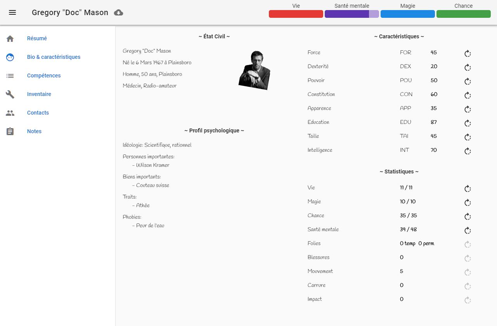
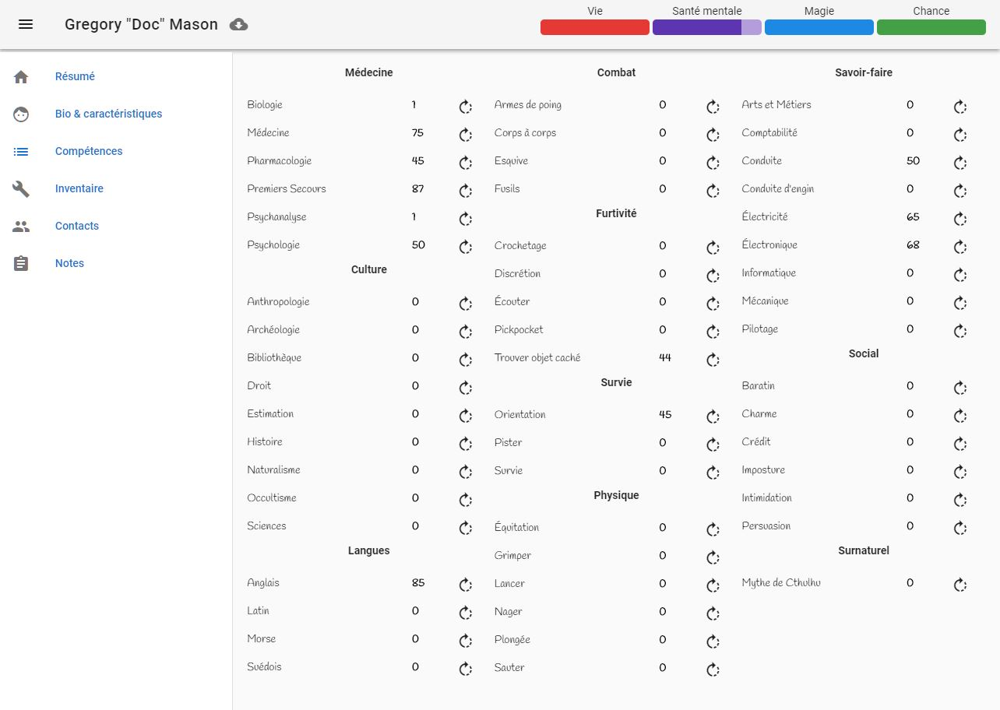

# Kashee

## English

Character sheets for Call of Cthulhu pen and paper game 7th Edition. Data need to be edited in JSON files in the folder src/assets

### How to run

You need to install :

1. [Node](https://nodejs.org/en/)
2. [npm](https://www.npmjs.com/get-npm) (you should already have it with Node) or [yarn](https://yarnpkg.com)

Then :

- execute `npm install` (or `yarn install`) to install dependencies
- execute `npm start` (or `yarn start`) to start application

### Screenshots

Here is example of some page of the application

### Roadmap

We are currently working on a "wizard character creation"

## French

Feuille de personnage pour le jeu de rôle l'Appel de Cthulhu V7. Les données sont a éditer au format JSON dans le dossier src/assets.

### lancer l'application

Vous devrez installer:

1. [Node](https://nodejs.org/en/)
2. [npm](https://www.npmjs.com/get-npm) (fourni avec Node) ou [yarn](https://yarnpkg.com)

Ensuite :

- executer `npm install` (or `yarn install`) pour installer les dépendences
- executer `npm start` (or `yarn start`) to lancer l'application

### Capture d'écran

Quelques exemples de page de l'application

### Plan de route

Nous travaillons actuellement sur un "assistant de création de personnage"
